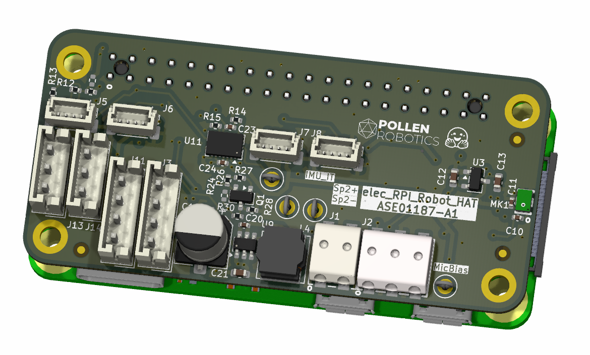

# "RPI_Robot_HAT" Electronic Board

"RPI_Robot_HAT" is a raspberry pi HAT designed for small/medium size robots. It has an IMU, Dynamixel connectors and audio. Its size fits a Raspberry PI zero.

## Basically
 - Designed with KiCAD 9.
